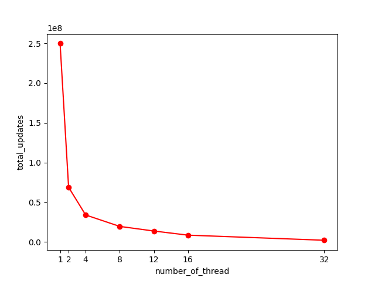
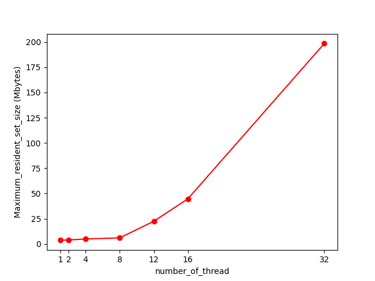

# Atomic Snapshot


### How to compile & execute

- run `compile.sh` in `project2` directory. 
- to execute, type `./run NUM_THREAD`
- output: number of total updates

### To test implementation

- run `./compile.sh debug` in project2 directory.
- execute `snapshot_test` in project2 directory.
- this test classes implemented in `AtomicSnapshot`.

### Example of compile & run

- for release version
```bat
$ cd project2
project2$ ./compile.sh 
project2$ ./run 16
3008543
```

- for debug version (using gtest)
```bat
$ cd project2
project2$ ./compile.sh debug
project2$ ./snapshot_test
```

----

## Performance Summary

When threads update snapshot concurrently, result was as below.

-  **System Info**
   -  CPU: AMD Ryzen 5600X @ - 4.6GHz 6 core 12 threads (hyperthread abled)
   -  RAM: 32GB
   -  OS: Ubuntu 20.04 LTS


### Concurrent efficiency: Total updates



### Memory Usage: Maximum resident set size (Mbytes)




## Performance Analysis

In this implementation, as number of thread increases(N), number of AtomicSingleRegister increases 3 squared(N^3) times. It's because that AtomicSnapshot has N AtomicMRSWRegisters, and each AtomicMRSWRegister has N^2 AtomicSingleRegisters.
And also, if number of thread increases, the probability of competition between `scan` and `updates` increases in AtomicSnapshot.

**Therefore, even if the number of threads increases by N times and the possibility of parallel calls increases by N times, the result is reduced by a squared multiple of N because there is a larger number of performance degradation than increase of parallel calls.**

##### * Note: Since multiplication of the number of threads degrades performance by an inverse multiple of the square value, the graph takes the form of a logarithmic function.

----

## Atomic Single(SRSW) Register

In Java, as JVM free unused class automatically, there is less need to take care of free.
But in C++, we have to meticulously take care of memory.
```C++
template <typename T>
class StampedValue{
public:
    uint64_t label;
    shared_ptr<T> value;

    StampedValue():label(0), value(nullptr) {};
    StampedValue(uint64_t label, shared_ptr<T> init_value): label(label) {value = init_value;};
    ~StampedValue() {};
};

template <typename T>
class AtomicSingleRegister{
private:
    uint64_t last_label;
    StampedValue<T>* last_read;
    StampedValue<T>* r_value;

    // below tow member variables are for writer & deconstructor to free OOOOOOLD StampedValue
    StampedValue<T>* last_free;
    queue<StampedValue<T>*> not_free_queue; 
public:
    shared_ptr<T> read();
    void write(shared_ptr<T> value_to_write);

    AtomicSingleRegister();
    AtomicSingleRegister(shared_ptr<T> init_value);
    ~AtomicSingleRegister();
};
```

To notice that the pointer will never be re-read by reader, writer compare last_free and last_read.
And then, writer free every pointers that have written before the latest one between last_free and last_read.

This is possible because reader never returns value written before last_read, and write function search for free only between that have been replaced by write function itself.

Thus, with this idea, we can implement leak-free(?) AtomicSingleRegister in C++.

```C++
template <typename T>
shared_ptr<T> AtomicSingleRegister<T>::read()
{
    StampedValue<T>* value = r_value;
    StampedValue<T>* last = last_read;
    StampedValue<T>* result = (value->label > last->label) ? value : last;
    last_read = result;
    return result->value;
}

template <typename T>
void AtomicSingleRegister<T>::write(shared_ptr<T> value_to_write)
{
    uint64_t label = last_label + 1;
    //push to queue when it has been replaced by write function.
    not_free_queue.push(r_value);
    r_value = new StampedValue<T>(label, value_to_write);
    last_label = label;

    StampedValue<T>* last = last_read;
    //get latest between last_read & last_free
    last_free = (last->label < last_free->label) ? last_free : last;
    
    //only free the values in the queue - that have been replaced.
    // do not free r_value due to the chance reader takes it.
    while (!not_free_queue.empty())
    {
        //if meet last_free, as it can be taken by reader, stop free.
        if (not_free_queue.front()->label == last_free->label)
            break;
        delete not_free_queue.front();
        not_free_queue.pop();
    }
}
```

----


## Atomic Multi-Reader Single-Writer (MRSW) Register

Atomic MRSW Register uses AtomicSingleRegister to make itself atomic.

If `a_table` consists of non-atomic register, data race occurs.

As AtomicMRSWRegister's implementation is almost same as we've learnd, more details will not be described.

```C++
template <typename T>
class AtomicMRSWRegister{
private:
    int num_reader;
    uint64_t last_label;
    vector<AtomicSingleRegister<StampedValue<T>>> a_table;
public:
    shared_ptr<T> read(int tid);
    void write(int tid, shared_ptr<T> value_to_write);

    // AtomicMRSWRegister();
    AtomicMRSWRegister(int num_reader, shared_ptr<T> init_value);
    ~AtomicMRSWRegister();
};

template <typename T>
class SnapValue{
public:
    uint64_t label;
    shared_ptr<T> value;
    shared_ptr<vector<shared_ptr<T>>> snap;

    SnapValue();
    SnapValue(uint64_t label, shared_ptr<T> value, shared_ptr<vector<shared_ptr<T>>> snap);
    SnapValue(shared_ptr<T> init_value);
    ~SnapValue() {};
};
```

----
## Atomic Snapshot

To implement Atomic Snapshot, first we have to implement `SnapValue` and use it as variables stored in atomic registers.

```C++
template <typename T>
class SnapValue{
public:
    uint64_t label;
    shared_ptr<T> value;
    shared_ptr<vector<shared_ptr<T>>> snap;

    SnapValue();
    SnapValue(uint64_t label, shared_ptr<T> value, shared_ptr<vector<shared_ptr<T>>> snap);
    SnapValue(shared_ptr<T> init_value);
    ~SnapValue() {};
};
```

To make other data type can be stored, SnapValue has the `shared_ptr` of template type `T`.

Implementation of `AtomicSnapshot` is not much different from the implementation of well-known.

```C++
template <typename T>
class AtomicSnapshot{
private:
    int num_registers;
    vector<AtomicMRSWRegister<SnapValue<T>>> registers;
    shared_ptr<vector<shared_ptr<SnapValue<T>>>> collect(int tid);
    shared_ptr<vector<shared_ptr<T>>> getValues(shared_ptr<vector<shared_ptr<SnapValue<T>>>> copy);
public:
    shared_ptr<vector<shared_ptr<T>>> scan(int tid);
    void update(int tid, shared_ptr<T> value_to_update);

    AtomicSnapshot(int num_registers, shared_ptr<T> init_value);
    ~AtomicSnapshot();
};
```
---
